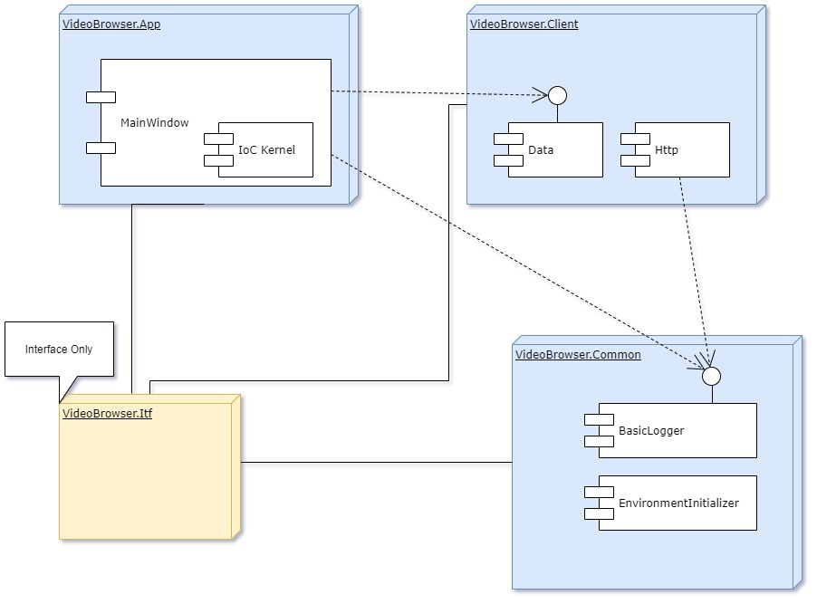

# Video Browser Application

## General

Video Browser Application is a Windows Desktop application to fetch, filter and brows videos.

## Requirements

Create a desktop WPF application to display video list.

Sign up to our site to use Video Promotion API, here: **Not Public**.

Requirements
- Only use the **Not Public** endpoint. <span style="color:green">Done</span>
- Create a search filter block with 2 filtering options at least. <span style="color:yellow">Partial: ComboBox created, Binding and BL is not imlemented</span>
- Show 25 videos per page. <span style="color:green">Done</span>
- Display the first preview image and minimum 4 other details from the response. <span style="color:green">Done</span>
- Create a pager to display more videos.<span style="color:green">Done</span>
- Use C# 4.6.2 or above. <span style="color:green">Done</span>
- Use error handling. <span style="color:yellow">Partial: basic error handling to aviod crash, Basic logging for BL</span>
- Use MVVM as architectural pattern. <span style="color:green">Done</span>
- Use Visual Studio 2017 or above. (Community edition is ok as well.) <span style="color:green">Done</span>
- Create local or GIT repository. <span style="color:green">Done</span>
- Commit after every important changes. <span style="color:green">Done</span>

## Initial Narratives

### Narrative 1: User Controls in Main Window
 ```
As a User of VBA
I want a UI for the application
So that
	- there is uniform Button style
	- there is Buttons for Previous and Next page
	- there is Button for Load Videos
	- there is Info about current and all pages
	- there is a List for Videos
	- there is a combobox for Filter options
```
### Narrative 2: User Functionality
```
As a User of VBA
I want to brows videos with the application
So that
	- to load videos by a Load Button
	- to be able to paging with Next and Previous Buttons
	- to be informed about current and all pages
	- to see image about Video, Title, Source, Durration and Quality
```

## Behaviour Specifications

### Behaviour 1: Starup state of UI
```
Given
	Windows Desktop and the executable of application
When
	Execute application
Then 
	Initial UI can be seen
		UI can be seen with all buttons (Load, Next, Previous),
		the combobox
		the info panel
```

### Behaviour 2: Load content
```
Given
	Initial UI
When
	Load button clicked
Then
	UI is not blocked
	After content download finnished
	First page of content can be seen with 25 item
		with Image
		with Title
		with Source
		with Source
		with Durration
		with Quality
```

### Behaviour 3: Next/Previous button
```
Given
	Loaded content
When
	Next/Previous button pressed
	There is available page
Then
	Next/Previous content loaded
	Info panel updated
```

## Architecture Baselines

There is four module in Application
- VideoBrowser.Itf for Interfaces (lazy reference coupling)
- VideoBrowser.App for UI logic
- VideoBrowser.Common for common BusinessLogic infrastructure
- VideoBrowser.Client for BusinessLogic




### VideoBrowser.App

General UI style defined in *App.xaml* file, and all style used as *StaticResource*. The MainWindow specific UI description (e.g. layout, custom view, list etc.) can be found in *MainWindow.xaml* Used UI elements and user controls are the nexts:

- Unified Butttons with key *BasicButton*, and custom styled *LoadButton* and *PagerButton* [Link](https://docs.microsoft.com/en-us/windows/uwp/design/controls-and-patterns/xaml-styles)
- TextBlock for Info about Paging State with key *PageInfo* [Link](https://docs.microsoft.com/en-us/dotnet/desktop/wpf/controls/styles-templates-overview?view=netdesktop-5.0)
- Combobox for Filter has key *FilterComboBox*
- Two Panel style are defined, one for Vertical panel with key *MenuPanel* and one for the Horizontal panel of pager controls with key *PagerPanel*
- Layout defined in *MainWindows.xaml* [Link](https://docs.microsoft.com/en-us/windows/uwp/design/layout/grid-tutorial)
- Scrollable Video list is also defined in *MainWindow.xaml* [Link](https://www.iranthajayasekara.com/blog/display-images-in-a-wpf-listbox.html)

IoC Kernel also implemented in this module, because it's not necessary to organize to an other separated module. The Kernel is responsible for Initializing and Dispose operations in BusinessLogic, but the MainWindow handles the Kernel.

### VideoBrowser.Client

This module contains the BusinessLogic. Two main responsibilies are defined (expect the domain, data and dto objects):
- VideoListContentController: fetch User actions in BL, evaluate and forward it.
- VideoSourceConnector: connect to the server, download data, retriev with content data.

Dots are only for communication, it's not supposed to occure outside of VideoSourceConnector.
Video Data objects are public and can be seen by Application layer as well. The binding of them to the UI is intended.

### VideoBrowser.Common

The general purposed infrastructural logic are separated from the core BusinessLogic. The implemented and used functionalities in Common module are:
- BasicLogger: to log main operation in BL.
- EnvironmentalInitializer: to prepare and clean environment (last files and folders), to read and provide config data of software.

### Tests

There is no tests for this project. Applied only manual tests.

There is an initial test api what had been used until the real api was not available.
