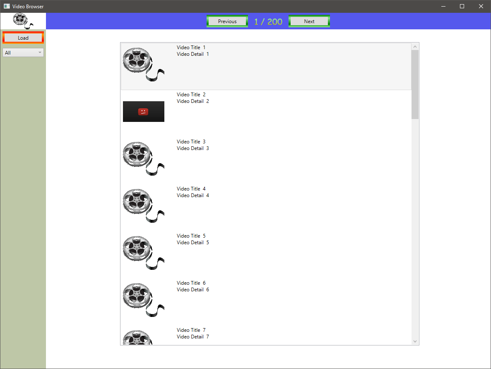

# Video Browser Application

## General

Video Browser Application is a Windows Desktop application to fetch, filter and brows videos.

## Requirements

### Narrative 1: User Controls in Main Window
 ```
As a User of VBA
I want a UI for the application
So that
	- there is uniform Button style
	- there is Buttons for Previous and Next page
	- there is Button for Load Videos
	- there is Info about current and all pages
	- there is a List for Videos
	- there is a combobox for Filter options
```

## Architecture Baselines

There is four module in Application
- VideoBrowser.Itf for Interfaces (lazy reference coupling)
- VideoBrowser.App for UI logic
- VideoBrowser.Common for common BusinessLogic infrastructure
- VideoBrowser.Client for BusinessLogic

### VideoBrowser.App

This module is responsible for the UI logic, UI definitions and the necessary Startup logic.

## Detailed Design

### VideoBrowser.App

General UI style defined in *App.xaml* file, and all style used as *StaticResource*. The MainWindow specific UI description (e.g. layout, custom view, list etc.) can be found in *MainWindow.xaml* Used UI elements and user controls are the nexts:

- Unified Butttons with key *BasicButton*, and custom styled *LoadButton* and *PagerButton* [Link](https://docs.microsoft.com/en-us/windows/uwp/design/controls-and-patterns/xaml-styles)
- TextBlock for Info about Paging State with key *PageInfo* [Link](https://docs.microsoft.com/en-us/dotnet/desktop/wpf/controls/styles-templates-overview?view=netdesktop-5.0)
- Combobox for Filter has key *FilterComboBox*
- Two Panel style are defined, one for Vertical panel with key *MenuPanel* and one for the Horizontal panel of pager controls with key *PagerPanel*
- Layout defined in *MainWindows.xaml* [Link](https://docs.microsoft.com/en-us/windows/uwp/design/layout/grid-tutorial)
- Scrollable Video list is also defined in *MainWindow.xaml* [Link](https://www.iranthajayasekara.com/blog/display-images-in-a-wpf-listbox.html)




